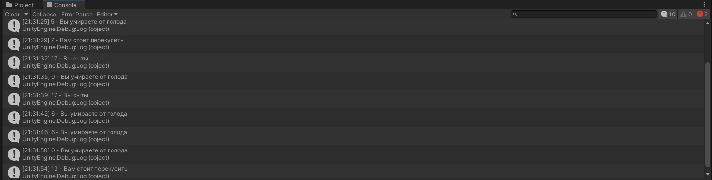

# АНАЛИЗ ДАННЫХ И ИСКУССТВЕННЫЙ ИНТЕЛЛЕКТ [in GameDev]
Отчет по лабораторной работе #2 выполнил:
- Малышев Георгий Валентинович
- РИ220934
Отметка о выполнении заданий (заполняется студентом):

| Задание | Выполнение | Баллы |
| ------ | ------ | ------ |
| Задание 1 | * | 60 |
| Задание 2 | * | 20 |
| Задание 3 | * | 20 |

знак "*" - задание выполнено; знак "#" - задание не выполнено;

Работу проверили:
- к.т.н., доцент Денисов Д.В.
- к.э.н., доцент Панов М.А.
- ст. преп., Фадеев В.О.


## Цель работы
Научиться передавать в Unity данные из Google Sheets с помощью Python.

## Задание 1
### Выберите одну из компьютерных игр, приведите скриншот её геймплея и краткое описание концепта игры. Выберите одну из игровых переменных в игре (ресурсы, внутри игровая валюта, здоровье персонажей и т.д.), опишите её роль в игре, условия изменения / появления и диапазон допустимых значений. Постройте схему экономической модели в игре и укажите место выбранного ресурса в ней.

Я выбрал самую популярную игру - Майнкрафт, в ней я выбрал шкалу голода, как одну из переменных. За счет этой переменной восстанавливается основной показатель - здоровье. Также при значении больше 6, персонаж может использовать спринт, а при значении 0 персонаж начинает терять хп. Условия изменения: шкалу можно пополнить едой и эффектами насыщения, убывает шкала, когда игрок передвигается, восстанавливает здоровье, или на игрока действует эффект голода.!

[Alt text](<Экономическая схема-1.png>)


## Задание 2
### С помощью скрипта на языке Python заполните google-таблицу данными, описывающими выбранную игровую переменную в выбранной игре (в качестве таких переменных может выступать игровая валюта, ресурсы, здоровье и т.д.). Средствами google-sheets визуализируйте данные в google-таблице (постройте график, диаграмму и пр.) для наглядного представления выбранной игровой величины.

```py

import gspread
import numpy as np
gc = gspread.service_account(filename='datascience-400712-ed1c052dfba5.json')
sh = gc.open("datascience")
hunger = np.random.randint(0, 20, 11)
for i in range(11):
    sh.sheet1.update(('A' + str(i+2)), i+1)
    sh.sheet1.update(('B' + str(i+2)), int(hunger[i]))

```

## Задание 3
### Настройте на сцене Unity воспроизведение звуковых файлов, описывающих динамику изменения выбранной переменной. Например, если выбрано здоровье главного персонажа вы можете выводить сообщения, связанные с его состоянием.

Я сделал так, чтоб воспроизводились соответствующие звуки, и комментарии выводились в лог.

```c#
void Update()
    {
        if (dataSet["Mon_" + i.ToString()] >= 17 & statusStart == false & i != dataSet.Count)
        {
            StartCoroutine(PlaySelectAudioGood());
            Debug.Log(dataSet["Mon_" + i.ToString()] + " - Вы сыты");
        }

        if (dataSet["Mon_" + i.ToString()] > 6 & dataSet["Mon_" + i.ToString()] < 17 & statusStart == false & i != dataSet.Count)
        {
            StartCoroutine(PlaySelectAudioNormal());
            Debug.Log(dataSet["Mon_" + i.ToString()] + " - Вам стоит перекусить");
        }

        if (dataSet["Mon_" + i.ToString()] <= 6 & statusStart == false & i != dataSet.Count)
        {
            StartCoroutine(PlaySelectAudioBad());
            Debug.Log(dataSet["Mon_" + i.ToString()] + " - Вы умираете от голода");
        }
    }
```

## Выводы

В ходе проведенных работ я научился передавать передавать в Unity данные из Google Sheets, а также генерировать данные в Google Sheets с помощью Python.


## Powered by

**BigDigital Team: Denisov | Fadeev | Panov**
