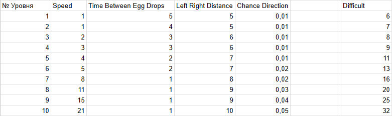
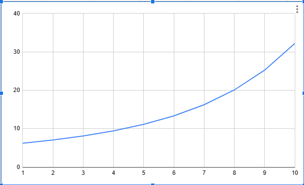
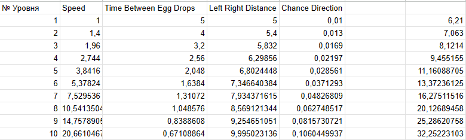
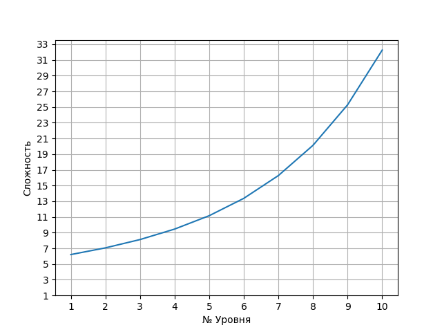

# АНАЛИЗ ДАННЫХ И ИСКУССТВЕННЫЙ ИНТЕЛЛЕКТ [in GameDev]
Отчет по лабораторной работе #3 выполнил:
- Малышев Георгий Валентинович
- РИ220934
Отметка о выполнении заданий (заполняется студентом):

| Задание | Выполнение | Баллы |
| ------ | ------ | ------ |
| Задание 1 | * | 60 |
| Задание 2 | * | 20 |
| Задание 3 | * | 20 |

знак "*" - задание выполнено; знак "#" - задание не выполнено;

Работу проверили:
- к.т.н., доцент Денисов Д.В.
- к.э.н., доцент Панов М.А.
- ст. преп., Фадеев В.О.


## Цель работы
Разработать оптимальный баланс для десяти уровней игры Dragon Picker

## Задание 1
### Предложите вариант изменения найденных переменных для 10 уровней в игре. Визуализируйте изменение уровня сложности в таблице.

Переменные, которые я нашел:

Speed - скорость передвижения дракона, 
Time Between Egg Drops - время между спавном яиц, 
Left Right Distance - дистанция между левой и правой границей  
Chance Direction - шанс того, что дракон изменит свое направление

Для того, чтобы усложнять игру мы будем увеличивать переменные в геометрической прогрессии.

Начальные переменные Speed = 1, Time Between Egg Drops = 5, Left Right Distance = 5, Chance Direction = 0,01 и коэфициенты к ним 1,4, 0,8, 1,08, 1,3, соответственно. Также игре нужны только целые значения, поэтому результаты приходиться округлять

Для визуализации данных я ввел новую переменную - Difficult, она отображает сложность уровня и находиться как сумма Speed, Left Right Distance, Chance Direction и 1/Time Between Egg Drops

Вот график зависимости сложности от уровня:



## Задание 2
### Создайте 10 сцен на Unity с изменяющимся уровнем сложности
Все сцены находяться здесь: https://github.com/GeorgiiMalishev/data-analysis-in-games/tree/main/Workshop3/DragonPickerDefault-main/Assets/_Scenes

## Задание 3
### Решение в 80+ баллов должно заполнять google-таблицу данными из Python. В Python данные также должны быть визуализированы.
Визуализировал данные в график с помощью библиотеки matpotlib
```py
import gspread
import matplotlib.pyplot as plt
import numpy as np

speed = 1
egg_time = 5
distance = 5
chance = 0.01
lvl_count = 10
ratios = [1.4, 0.8, 1.08, 1.3]
difficult = []

gc = gspread.service_account(filename='datascience-400712-ed1c052dfba5.json')
sh = gc.open("datascience")

sh.sheet1.update(('A1'), "№ Уровня")
sh.sheet1.update(('B1'), "Speed")
sh.sheet1.update(('C1'), "Time Between Egg Drops")
sh.sheet1.update(('D1'), "Left Right Distance")
sh.sheet1.update(('E1'), "Chance Direction")

for i in range(1, 11):
    difficult.append(speed + distance + chance + 1/egg_time)
    sh.sheet1.update(('A' + str(i+1)), i)
    sh.sheet1.update(('B' + str(i+1)), speed)
    sh.sheet1.update(('C' + str(i+1)), egg_time)
    sh.sheet1.update(('D' + str(i+1)), distance)
    sh.sheet1.update(('E' + str(i+1)), chance)
    sh.sheet1.update(('G' + str(i+1)), difficult[i-1])
    speed *= ratios[0]
    egg_time *= ratios[1]
    distance *= ratios[2]
    chance *= ratios[3]
    
fig, ax = plt.subplots()
x = np.arange(1, 11)
y = np.array(difficult)
ax.plot(x, y)
ax.grid()
plt.xticks(range(1, 11, 1), range(1, 11, 1))
plt.yticks(range(1, 35, 2), range(1, 35, 2))
plt.xlabel("№ Уровня")
plt.ylabel("Сложность")
plt.show()
```



## Выводы

В ходе проведенных работ были добавлены 10 сцен с возрастанием сложности в игру Dragon Picker, написан скрипт на Python, который заполняет таблицу данными, необходимыми для создания сцен, и визуализирует эти данные. 


## Powered by

**BigDigital Team: Denisov | Fadeev | Panov**
