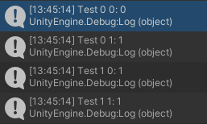
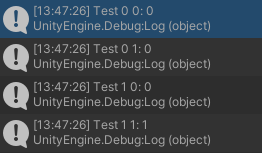
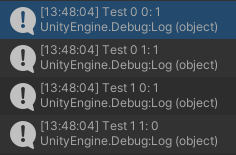
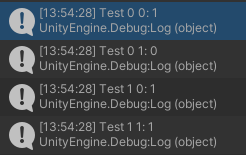
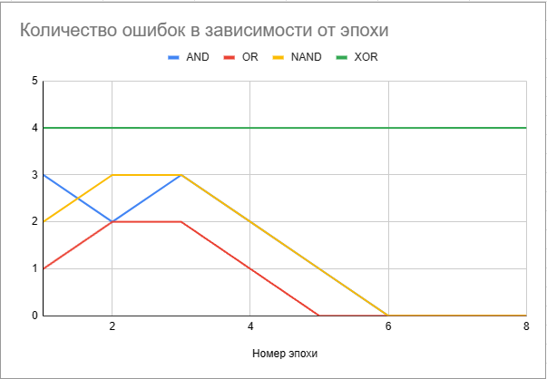
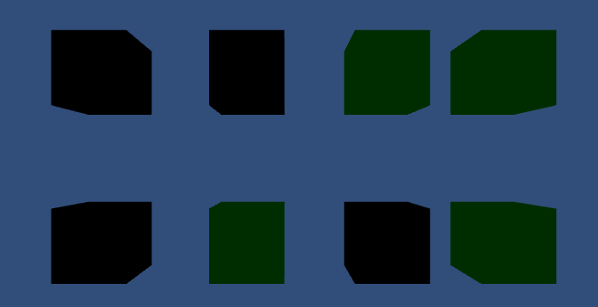
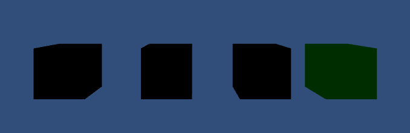

# АНАЛИЗ ДАННЫХ И ИСКУССТВЕННЫЙ ИНТЕЛЛЕКТ [in GameDev]
Отчет по лабораторной работе #4 выполнил:
- Малышев Георгий Валентинович
- РИ220934
Отметка о выполнении заданий (заполняется студентом):

| Задание | Выполнение | Баллы |
| ------ | ------ | ------ |
| Задание 1 | * | 60 |
| Задание 2 | * | 20 |
| Задание 3 | * | 20 |

знак "*" - задание выполнено; знак "#" - задание не выполнено;

Работу проверили:
- к.т.н., доцент Денисов Д.В.
- к.э.н., доцент Панов М.А.
- ст. преп., Фадеев В.О.


## Цель работы
Изучить перцептрон, реализовать в Unity и визуализировать его работу.

## Задание 1
### в проекте Unity реализовать перцептрон, который умеет производить вычисления:
### OR | дать комментарии о корректности работы
### AND | дать комментарии о корректности работы
### NAND | дать комментарии о корректности работы
### XOR | дать комментарии о корректности работы

  


Перцептрон корректно работает с OR, AND и NAND


С XOR же перцептрон будет ошибаться при любых весах, из этого следует, что использование перцептрона с XOR не имеет смысла.

## Задание 2
### Построить графики зависимости количества эпох от ошибки  обучения. Указать от чего зависит необходимое количество эпох обучения.


Количество необходимых эпох зависит от сложности операции и скорости нахождения нужных весов.

## Задание 3
### Построить визуальную модель работы перцептрона на сцене Unity. Можно использовать GameObject Сube и метод OnCollisionEnter.
Для этого задания я написал скрипт, который применил к нижним кубам, к верхним применена физика падения
```c#
using System;
using System.Collections;
using System.Collections.Generic;
using UnityEngine;

public class NewBehaviourScript : MonoBehaviour
{
    private Material greenColor;
    private Material blackColor;
    
    [SerializeField]
    private Perceptron perc;
    
    public double GetDigit(Material material) => material.name == "GreenColor (Instance)" ? 1 : 0;

    public void Start()
    {
        greenColor = Resources.Load<Material>("GreenColor");
        blackColor = Resources.Load<Material>("BlackColor");
        perc = GameObject.Find("Perceptron").GetComponent<Perceptron>();
    }
    
    private void OnCollisionEnter(Collision other)
    {
        var cubColor = GetComponent<MeshRenderer>().material;
        var otherColor = other.gameObject.GetComponent<MeshRenderer>().material;
        gameObject.GetComponent<MeshRenderer>().material = perc.CalcOutput(GetDigit(otherColor), GetDigit(cubColor)) == 1 ? greenColor : blackColor;
        Destroy(other.gameObject);
    }
}
```
Начальные условия:
 

AND


OR


NAND


Ну и XOR, который каждый раз выдает разные значения


## Выводы
В этой лабораторной работе я познакомился с перцептроном, показал на графике зависимость ошибок от эпохи и реализовал в Unity наглядный пример работы перцептрона.


## Powered by

**BigDigital Team: Denisov | Fadeev | Panov**
